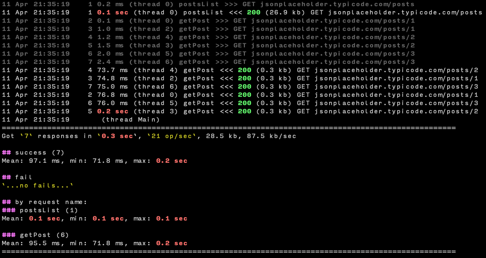

Bombard
=======

|build_status| |pypi_version| |pypi_license| |readthedocs|

Bombards target server with simultaneous requests 
to reveal any problems under the stress.

Install with pip

.. code-block:: bash

    pip install bombard --upgrade

After that use ``bombard`` (``bombard.exe`` in Windows) executable:

.. code-block:: bash

    bombard --help

Requests can contain JSON described in yaml file like this

.. code-block:: yaml

    getToken:
        url: "{base}auth"
        method: POST
        body:
            email: name@example.com
            password: admin
        extract:  # get token for next requests
            token:

In first request you can get security token as in example above.

And use it in next requests. Python in-line supported:

.. code-block:: yaml

     postsList:
        url: "{host}posts"
        headers:
            Authorization: "Bearer {token}"
        script: |
            for post in resp[:3]:  # add getPost requests for 1st ten posts in the list
                reload(ammo.getPost, id=post['id'])

Included examples. To list examples

.. code-block:: bash

    bombard --examples

From command line you can change number of threads, loop count,
supply vars, customize report and so on.

Example of report for the command::

    bombard --example simple --repeat 2 --threshold 100

Documentation
-------------
`Bombard documentation <https://bombard.readthedocs.io/en/latest/>`_

.. |build_status| image:: https://travis-ci.org/masterandrey/bombard.png
    :target: https://travis-ci.org/masterandrey/bombard
    :alt: Latest release

.. |pypi_version| image:: https://img.shields.io/pypi/v/bombard.svg?style=flat-square
    :target: https://pypi.org/p/bombard
    :alt: Latest release

.. |pypi_license| image:: https://img.shields.io/pypi/l/bombard.svg?style=flat-square
    :target: https://pypi.python.org/pypi/bombard
    :alt: MIT license

.. |readthedocs| image:: https://readthedocs.org/projects/bombard/badge/?version=latest
    :target: https://bombard.readthedocs.io/en/latest/?badge=latest
    :alt: Documentation Status

