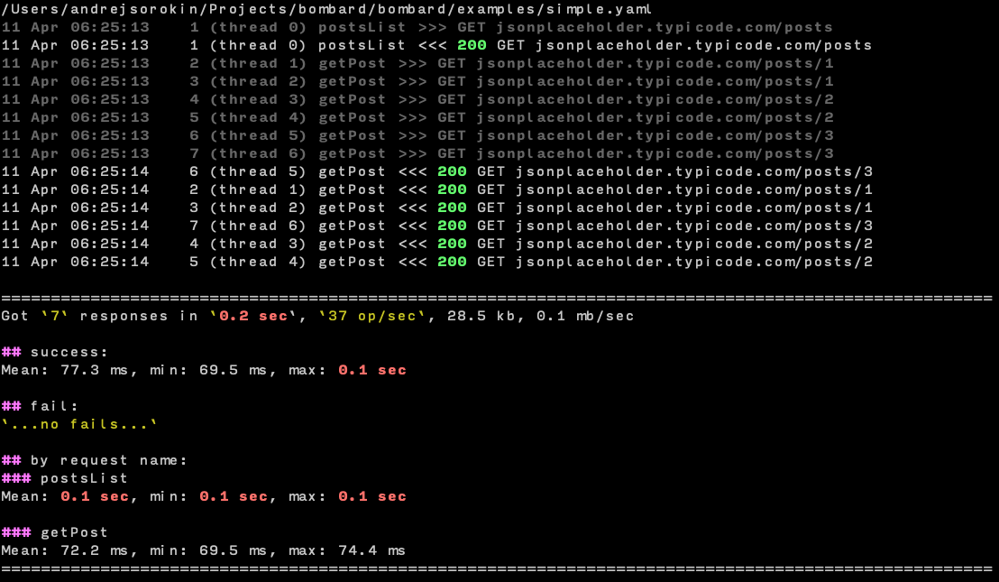

bombard
=======

`Русский <https://bombard.masterandrey.com/ru/latest/>`_
--------------------------------------------------------

Introduction
------------

Bombard is a tool for stress test and benchmarking your HTTP server.
Especially it's good to simulate a heavy load and initial burst of
simultaneous HTTP requests with complex logic.

It is designed to be extremely simple yet powerful tool to
load test functional behavior.

Thanks to optional Python inlines you can fast and easy describe
complex logic for the tests.

Test report shows you how many requests per second your server
is capable of serving and with what latency.

Requests description
--------------------

Requests can be just URL or contain JSON described like this

.. code-block:: yaml

    getToken:
        url: "{base}auth"  # use custom {base} variable to stay DRY
        method: POST
        body:  # below is JSON object for request body
            email: name@example.com
            password: admin
        extract:  # get token for next requests
            token:

In first request you can get security token as in example above.

And use it in next requests:

.. code-block:: yaml

     postsList:
        url: "{host}posts"
        headers:
            Authorization: "Bearer {token}"  # we get {token} in 1st request
        script: |
            for post in resp[:3]:  # for 1st three posts from response
                # schedule getPost request (from ammo section)
                # and provide it with id we got from the response
                reload(ammo.getPost, id=post['id'])

Included examples. To list examples

.. code-block:: bash

    bombard --examples

Command line
------------

From command line you can change number of threads, loop count,
supply vars, customize report and so on.

Also you can bootstrap your own ``bombard.yaml`` file from any example you
like::

    bombard --init --example simple

Report
------

Example of report for the command::

    bombard --example simple --repeat 2 --threshold 100

Source code
-----------

`GitHub <https://github.com/masterandrey/bombard/>`_

Documentation
-------------

.. toctree::
   :glob:
   :maxdepth: 3

   quickstart/install
   quickstart/bootstrap
   campaign
   report

