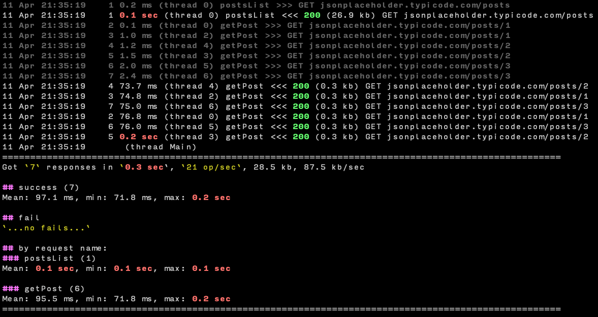

# Introduction

A flexible tool for stress testing servers with easily configurable requests.

Bombard allows you to simulate high-load scenarios by sending customizable requests to your server, helping you assess its performance and stability under stress.

It's especially good at simulating heavy loads and initial bursts of simultaneous HTTP requests with complex logic.

Bombard is designed to be an extremely simple yet powerful tool for load testing functional behavior.

Thanks to optional Python inlines, you can quickly and easily describe complex logic for your tests.

The test report shows you how many requests per second your server is capable of serving and with what latency.

## Requests description

Requests can be just URL or contain JSON described like this:

```yaml
supply:  # you can redefine variables from command line (--supply host=http://localhost/)
  host: https://jsonplaceholder.typicode.com/

getToken:
    url: "{host}auth"  # use {host} variable from supply to stay DRY
    method: POST
    body:  # below is JSON object for request body
        email: name@example.com
        password: admin
    extract:  # get token for next requests
        token:
```

In the first request, you can get a security token as in the example above.

And use it in next requests like that:

```yaml
postsList:
    url: "{host}posts"
    headers:
        Authorization: "Bearer {token}"  # we get {token} in 1st request
    script: |
        for post in resp[:3]:  # for 1st three posts from response
            # schedule getPost request (from ammo section)
            # and provide it with id we got from the response
            reload(ammo.getPost, id=post['id'])
```

Included examples. To list examples:

```bash
bombard --examples
```

## Command line

From command line you can change number of threads, loop count, supply vars, customize report and so on.

Also you can bootstrap your own `bombard.yaml` file from any example you like:

```bash
bombard --init --example simple
```

## Report

Example of report for the command:

```bash
bombard --example simple --repeat 2 --threshold 100
```



## Source code

[GitHub](https://github.com/andgineer/bombard/)
